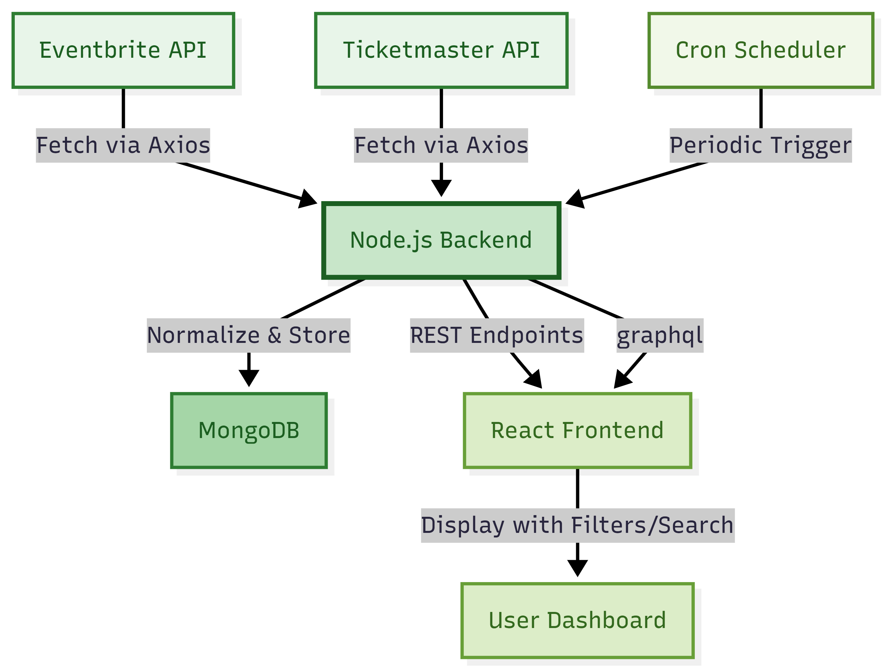

# Smart Event Feed Aggregator 🚀

**MERN Stack Event Dashboard** - Aggregates tech events from Ticketmaster & Eventbrite with fuzzy search, smart categorization, and responsive UI.

## ✨ Features

| Feature | Status |
|---------|--------|
| **Dual API Integration** | ✅ Ticketmaster + Eventbrite |
| **Smart Category Detection** | ✅ Auto-classifies 8 categories |
| **Fuzzy Multi-field Search** | ✅ Title, description, location |
| **Periodic Data Refresh** | ✅ Hourly cron + 90-day cleanup |
| **REST + GraphQL APIs** | ✅ Both fully implemented |
| **Responsive Dashboard** | ✅ Mobile → Desktop perfect |
| **Real-time Stats** | ✅ Source breakdown + totals |

## 🎨 Design Explanation

### **Design Principles**
1. **Glassmorphism UI** - Modern frosted glass cards with backdrop blur
2. **Gradient Aesthetics** - Indigo → Purple → Pink color harmony
3. **Progressive Disclosure** - Filters expand on larger screens
4. **Motion Design** - Hover animations, smooth transitions
5. **Accessibility** - Keyboard navigation, high contrast, ARIA labels

### **Responsive Breakpoints**
Mobile (320px+) → 1-col grid, stacked filters, touch-friendly
Tablet (640px+) → 2-col grid, 2-col filters
Laptop (1024px+) → 3-col grid, 4-col filters
Desktop (1280px+) → 4-col grid, full-width hero

### **UI Components**
Header → Responsive typography (3xl→7xl)
SearchBar → Full-width mobile, centered desktop
FilterPanel → Stacked→Grid layout
EventCard → Image-first, hover lift effect
EventList → CSS Grid responsive
EmptyState → Centered illustration + CTA

## 🚀 Quick Setup

### **Prerequisites**
Node.js 18+ 
MongoDB Atlas
Ticketmaster API Key 
Eventbrite Token 

### **1. Clone & Backend Setup**
git clone https://github.com/AshenafiZ/Smart-Event-Feed-Aggregator.git
cd Smart-Event-Feed-Aggregator/backend
cp .env

TICKETMASTER_KEY=your_key
MONGODB_URI=your_connection_string

npm install
npm start

http://localhost:5000/graphql

### **2. Frontend Setup**

cd ../frontend
npm install
npm run dev

http://localhost:5173 (auto-proxies backend)

### **3. Verify**

Backend: http://localhost:5000/api/events?limit=5
Frontend: http://localhost:5173
GraphQL: http://localhost:5000/graphql

## 📋 API Documentation

### **GraphQL Playground**

http://localhost:5000/graphql

All events
query {
events(limit: 10) {
title date category source imageUrl
}
}

Filtered
query {
events(category: "hackathon", limit: 5) {
title venueName city
}
}

Stats
query { stats { total bySource { _id count } } }

### **REST API**

GET /api/events?search=react&category=seminar
GET /api/stats

## 🔑 API Keys Required

### **Ticketmaster (REQUIRED)**

developer.ticketmaster.com

Sign up → Get API Key (Free)

backend/.env → TICKETMASTER_KEY=your_key

### system diagram

### Design explanation

The design focuses on clarity, responsiveness, and fast discovery of relevant events.

### Visual and UX design
The UI uses a clean, card-based layout with soft gradients and glassmorphism-style panels to make each event visually distinct while keeping the page uncluttered. Typography scales across breakpoints (mobile to desktop) so the hero title, search, and event details remain readable on any screen size. The layout is fully responsive: on mobile you see a single column with filters and full-width search, while on larger screens the grid expands to multiple columns with a compact filter panel.

### Interaction and filtering
Search and filters are placed at the top, centered, so users naturally start by narrowing down events. The search bar performs fuzzy matching across multiple fields (title, description, location, category) to handle typos and partial matches. Category and source filters are simple dropdowns with an “All” option, designed so empty values fall back to “show everything” instead of hiding results. Loading spinners and empty states provide clear feedback so users always understand whether data is still loading or genuinely unavailable.

### Backend and data design
APIs (Ticketmaster and optionally Eventbrite) are normalized into a single Event schema with consistent fields like title, date, location, source, category, and imageUrl. A small classification step infers high-level categories (seminar, hackathon, workshop, etc.) from event names and genres to make filtering meaningful without manual tagging. REST and GraphQL sit on the same data model so the same filters and search logic are available both to the React dashboard and to any other client. Periodic background jobs keep the data fresh while a 90‑day cleanup prevents the database and UI from filling with stale past events.